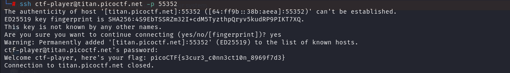

AUTHOR: JEFFERY JOHN

Description
Using a Secure Shell (SSH) is going to be pretty important.
Can you ssh as ctf-player to titan.picoctf.net at port 55352 to get the flag?
You'll also need the password 83dcefb7. If asked, accept the fingerprint with yes.
If your device doesn't have a shell, you can use: https://webshell.picoctf.org
If you're not sure what a shell is, check out our Primer: https://primer.picoctf.com/#_the_shell

Hints-1: https://linux.die.net/man/1/ssh
Hints-2: You can try logging in 'as' someone with <user>@titan.picoctf.net
Hints-3: How could you specify the port?
Hints-4: Remember, passwords are hidden when typed into the shell

Solution:

connect through the SSH:

    ssh ctf-player@titan.picoctf.net 
    password - 83dcefb7

Flag:

