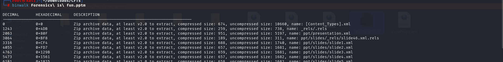
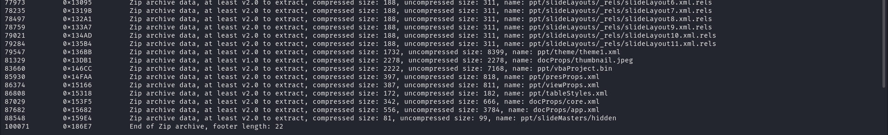
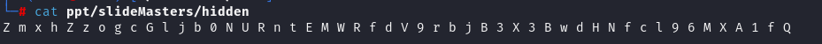

# MacroHard WeakEdge

## Descriptions

    Description
    I've hidden a flag in this file. Can you find it? Forensics is fun.pptm

`points 60`

**Solution:**

*At last line catches our interest `88548         0x159E4         Zip archive data, at least v2.0 to extract, compressed size: 81, uncompressed size: 99, name: ppt/slideMasters/hidden`* we can directly cat in to the file.

    cat ppt/slideMasters/hidden

**jsut a random char, mostly are the base64 so i decrypt it and get the flag.**

`flag: picoCTF{D1d_u_kn0w_ppts_r_z1p5}`

