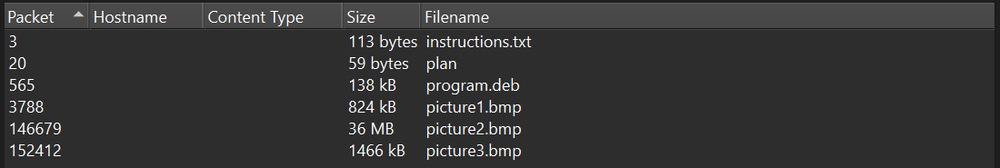
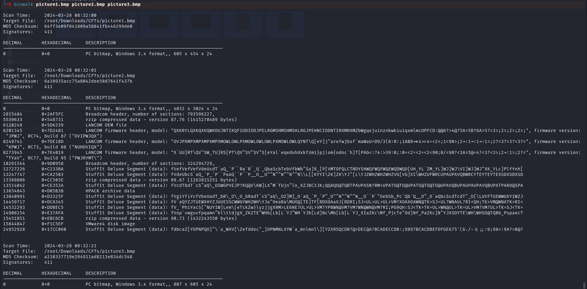

# Trivial Flag Transfer Protocol

Description:

    AUTHOR: DANNY
    Description
    Figure out how they moved the flag.

solution:

**open the file in wireshark:**

by observing the packet 3 i get the idea the data is transfred between so data is also inside the packets.

    file > Export Objects > TFTP

1. instruction.txt

decrypt with R0T13
TFTP DOESNT ENCRYPT OUR TRAFFIC SOWE MUST DISGUISE OUR FLAG TRANSFER.I GURE OUT AWAY TO HIDE THE FLAG AND I WILL CHECK BACK FOR THE PLAN.

`./plan` I USED THE PROGRAM AND HID IT WITH-DUEDILIGENCE. CHECKOUT THE PHOTOS

`use "DUEDILIGENCE" is a password`

file extracted file.txt
`flag: picoCTF{h1dd3n_1n_pLa1n_51GHT_18375919}`
